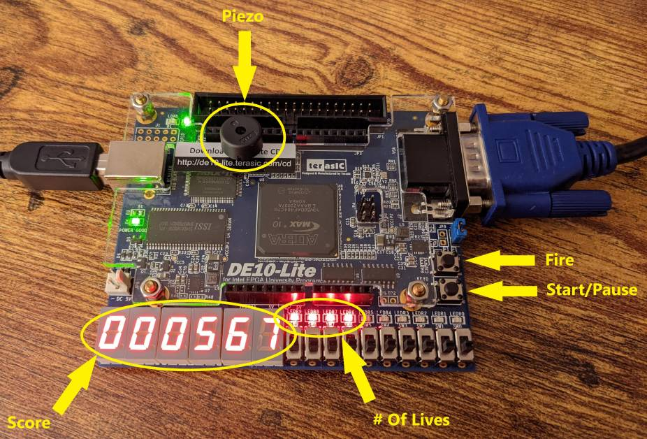

# fpga-defender
This project was created for Dr. J. W. Bruce's [Digital System Design](http://jwbruce.info/teaching/ece4110/) class at [Tennessee Technological University](https://www.tntech.edu/engineering/programs/ece/).

# Demo

   

[Video with sound](https://www.youtube.com/watch?v=Bie1J2sb7rM)
# Specification
Create a simplified, stylized version of the 1981 arcade classic [*Defender*](https://en.wikipedia.org/wiki/Defender_(1981_video_game)) for the [DE10-Lite](https://www.terasic.com.tw/cgi-bin/page/archive.pl?Language=English&No=1021) MAX 10 FPGA dev board. The video output is 640x480 @ 60 Hz over VGA. The ship is controlled using the on-board accelerometer. Tilting the board from the horizontal will move the ship up, down, left, and right. On-board pushbuttons control game start, pause, and ship fire. Sound effects are played on an attached piezo buzzer. The score is displayed at the top right of the screen, and the current number of lives is shown at the top left. Also, the score and lives are indicated on the 7-segment displays and LEDs on-board.

  

# Gameplay
Enemies spawn in from the right. The spawning is random, using a [LFSR](https://en.wikipedia.org/wiki/Linear-feedback_shift_register) pseudorandom number generator. With each spawn, a random enemy "variant" and location is chosen. Each "variant" consists of a sprite and a scale factor. Points are awarded for destroying the enemies. More points are awarded for smaller enemies. As your score increases, the "stage" is increased. In later stages, more enemies are on-screen at once and the enemy speed is increased. Colliding with an enemy results in a lost life. When all lives are lost, the game is over. Every 500 points, an extra life is awarded.

# Sound effects
The [effect_gen](bonuses/proj1/sound_effects/effect_gen.vhd) module controls the piezo buzzer. This module is a [FSM](https://en.wikipedia.org/wiki/Finite-state_machine) that read a simple "program" from an initialized [BRAM](https://www.nandland.com/articles/block-ram-in-fpga.html) in the FPGA. The [program](bonuses/proj1/res/effect_mem.mif) is simply a list of frequencies and durations to be played on the buzzer that make a sound effect.

# Sprites
The sprites are drawn using the [sprite_draw](bonuses/proj1/sprite_draw.vhd) module. This module was heavily inspired by the SystemVerilog code and ideas presented in the Project F [FPGA Graphics blog](https://projectf.io/posts/fpga-graphics/). I ported much of the author's code to VHDL and made modifications for my use case. I learned so much from this blog and I am grateful to the author for their open-source contributions. These sprites are used for the enemies, ship, and the large text on the title screen. The actual sprite [images](bonuses/proj1/res/sprite_data.mif) are heavily based on the original *Defender* sprites. I used palettized color with 16 [colors](bonuses/proj1/res/palette.mif) for simplicity.

# Text
For the smaller texts, I used the very useful module [FP-V-GA Text](https://github.com/MadLittleMods/FP-V-GA-Text). I had to make a minor modification to their code to work with the pixel clock, instead of 2x the pixel clock.

# Starfields
Again, I was inspired by the Project F [blog](https://projectf.io/posts/fpga-ad-astra/) for the [starfield](bonuses/proj1/starfield.vhd) module. This module works by using another LFSR, reading out the sequence to determine each pixel of the starfield, as well as its brightness. The LFSR is reset at a certain count value in order to get the "scrolling" effect. One modification I made was to allow the starfield to be "frozen" in place. There are three layered starfields, each having different speeds and densities.

# Smoothness
The screen captures shown in the "Demo" section are quite choppy and full of visual glitches. This is due to the low-quality capture hardware available on a fixed budget :) The actual output on a VGA monitor is actually quite smooth (60 FPS), sharp, and devoid of graphical artifacts or tearing. Surprisingly, this was done without framebuffering. I simply restricted all object "state" updates to the end of the frame, i.e. during the blanking interval, when the screen is not actively drawing the frame. All updates are done before the drawing of the next frame begins, so there is no tearing.

# FPGA Resource Usage

  

